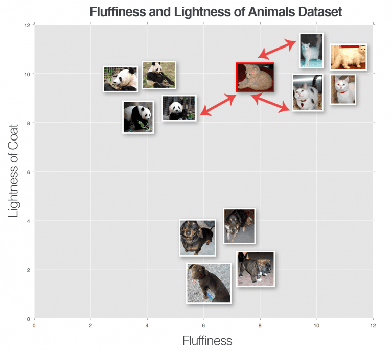

# k-NN Classifier: Hot dog or not hot dog

In this project, k-Nearest Neighbors (k-NN) is used for image classification. We start by classifying images into two categories
(1) Hot dog, or (2) not hot dog (literally anything other than hot dogs). We see the results of how good we can classify images 
into either of those categories. We then run a series of images of hamburgers to see what they get classified as. This is
to demonstrate that the k-NN isn't really learning any specific features about the images, but rather just comparing distances.
We see that hamburgers can be easily misclassified as hot dogs.

This is project is to demonstrate the use of the simple but sometime effective k-NN algorithm and showcase some of its 
downfalls.


## Description
The goal of this project is to train a k-NN classifier on the raw pixel values of the dataset and use it
to classify unknown images.

The k - Nearest Neighbor algorithm is a very simple image classification and machine learning algorithm (probably the most
simple). Rather than learning specific features about an image, k-NN relies on computing the distance between feature vectors
and finding the most common class amoung the 'k' closest data points in the model (with each data point casting a vote and
the class with the highest number of votes wins).

This is best shown in the figure from [Pyimagesearch](https://pyimagesearch.com/2021/04/17/your-first-image-classifier-using-k-nn-to-classify-images/?_ga=2.211896913.49613672.1647198253-1931257770.1641919015):  


#### Pipeline overview:
This project follows the traditional machine learning pipeline, which is:
1. **Gather the Dataset**
   1. I haven't included the entire dataset used for this project, but there is a sample of the images.
2. **Split the Dataset (Training and Evaluation)**
   1. This project uses a 80% training to 20% testing split.
3. **Train the Classifier (kNN)**
   1. Use the raw pixel values of the images to train a model
4. **Evaluate Model**
   1. Use the test set to gauge the performance of the trained model.
   
## Classification Results:
To train the model we use ~1000 images of the 'Hot Dog' class and ~1000 images of the 'Not Hot Dog' class. The 'Not Hot Dog' class
can be anything (basketball, beach, chair, etc). These images are used to train a model which is used to classify new images
into either the **'Hot Dog'** or **'Not Hot Dog'** category.

#### Example Hot Dog Image:  


#### Example Not Hot Dog Image:  


### Results
We then used ~250 images of each class to quantify the classification results of the model. These results can be seen below:
```buildoutcfg
              precision    recall  f1-score   support

      hotdog       0.80      0.61      0.69       370
   nothotdog       0.53      0.74      0.61       219

    accuracy                           0.66       589
   macro avg       0.66      0.67      0.65       589
weighted avg       0.70      0.66      0.66       589
```
We can see that we had about 80% accuracy in correctly classifying images as hotdogs and 53% accuracy for classifying images 
as anything other than a hot dog.
  
Not bad! But this is an easy one. We have one very specific class and one super broad. So getting a decent accuracy in the
specific class is not surprising. But to showcase the weakness of the kNN, what if we picked all of the 'Not Hot Dog' images 
to be of... a Hamburger! How well will the trained kNN work now? Let's find out.

We then fed 25 images of hot dogs and 25 images of hamburgers ('not hot dog') into the same trained model, and the results
can be seen below:  
```buildoutcfg
              precision    recall  f1-score   support

      hotdog       0.38      0.48      0.42        25
   nothotdog       0.28      0.20      0.23        25

    accuracy                           0.34        50
   macro avg       0.33      0.34      0.33        50
weighted avg       0.33      0.34      0.33        50
```  
We see that we perform very poorly in the 'not hot dog' category (and the 'hot dog' category) with an accuracy of 28%. The
results are not surprising. This is because all the 'not hot dog' images were hamburgers, which if you look at the example hamburger
image below....

#### Example Hamburger Image:  
  


The images of the hamburger and hot dog are not that different, especially when they are downsized to 32x32 images!

## Getting Started

### Dependencies

See requirements.txt

### Installing

#### Clone the project:
```
git clone git@github.com:reedajohns/k-NN-Image-Classifier-Hot-Dog-or-Not-Hot-Dog.git
```
#### Image paths:
The images in this dataset follow the format of:
```/path/to/dataset/{class}/{image}.jpg```    

All we have to do is supply the main image directory path and the script will load the subdirectories as the class of image
and the image paths within that class subdir.

### Executing program

Open terminal and run command:
```
python k-NN_main.py -d DATA_PATH
```
Where DATA_PATH is your properly formatted data directory.

Example:
```
python k-NN_main.py -d ../dataset/hot-dog
```

## Authors

Contributors names and contact info

Reed Johnson (https://www.linkedin.com/in/reed-a-johnson/)

## Version History

* 0.1
    * Initial Release

## License

This project is licensed under the GNU GENERAL PUBLIC License - see the LICENSE.md file for details

## Acknowledgments

Inspiration, code snippets, etc.
* [Pyimagesearch](https://pyimagesearch.com/2021/04/17/your-first-image-classifier-using-k-nn-to-classify-images/?_ga=2.211896913.49613672.1647198253-1931257770.1641919015)